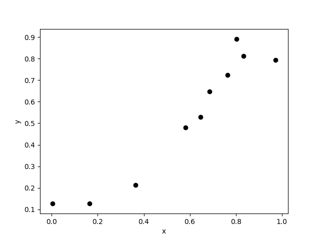
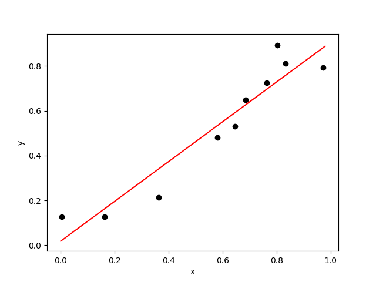
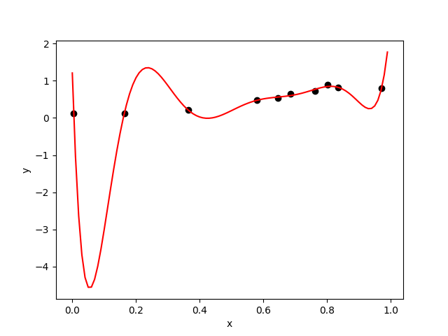
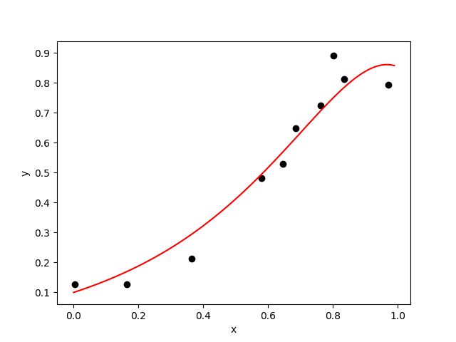

# 事前学習その２: 過学習と正則化

### 直線以外でも回帰できる
線形回帰の広がりを見るために，ボストンデータセットから少し離れてみましょう．
次の図のようなデータがあったとします．

さて，このデータに直線のモデル

を当てはめてみましょう．結果は下の図のようになります．

この解析で十分と考える人も多いでしょう．でも，かなり点からずれている部分もありますよね．それでは次のモデルを考えて見ます．

途中，数式を省略していますが，`x` のべき乗，つまり「曲がった関数」も使ってデータに当てはめてみる，ということです．ここでは8次関数まで使っています．

ここで数学に少し詳しい人向けに説明をしておきます．線形回帰の「線形」って直線のことでは？ と思うかもしれませんが，これは「線形代数」などで使われる意味での「線形」です（詳しくは数学の教科書を）．パラメータについて線形ということであって，上の式は例えば

- 説明変数その１が `x`
- 説明変数その２が `xの2乗` （つまり入力データを2乗した値を使えばいい）
- 説明変数その３が・・

ということに対応します．入力データの次元（特徴量の数）を「べき乗して増やす」ということですね．もっとわかりやすくすれば，

というモデルを考えているだけ，ということですね．こうすれば説明変数が8個の通常の線形回帰です．

さて．このモデルをデータに当てはめると下の図のような結果を得られます．

いかがでしょうか？ 各点に近くなるような曲線が得られていますが，でもちょっと・・という感じですよね．

***
### 過学習の問題
さて，上のような結果が得られてしまったのは，手元にあるデータだけを見たから，です．もう少しデータが増えて，例えば `x=0.1` のあたりの `y` の値がわかれば，ここまでひどい解析にはならなかったことでしょう．

このように，手元にあるデータを「学び過ぎる」ことを **過学習** と言います．データが少ないのに少し複雑で柔軟性のあるモデルで解析しようとしたために，このようなことが起きてしまいました．これを避けるためには，モデルをもっと限定することが必要です．例えば「このデータは直線で解析できる」と考えれば，最初にやったような解析結果を得ることができます．

一般に，パラメータの数が増えれば，モデルは柔軟になり，複雑な関数を表現できるようになります．そのぶん，学習にはたくさんのデータが必要になりますし，過学習もおこりやすくなります．

では，どの程度の複雑さを持ったモデルを使うべきでしょうか？ このような問題を **モデル選択** と呼び，例えば **AIC** などの尺度が知られています（これは **赤池情報量基準 (Akaike Information Criteria)** と言って，日本で提案された世界的な指標です．調べてみてくださいね）．

***
### リッジ回帰とLASSO
ここでは過学習の問題を避けるために **正則化** という技術を紹介しましょう．

モデルをデータに当てはめることでパラメータを推定することが線形回帰の基本です．ということは，データをできるだけ説明できる方が良い，誤差が小さい方が良いわけですが，ここでは代わりに次のような尺度を考えてみます．

1. モデルから予測した値と実際の値との誤差が小さくなるようにする．
1. 求めたパラメータの大きさをできるだけ小さくする．

１つ目の尺度が普通の線形回帰の考え方ですね．そこに２つ目の尺度を加えてしまいます．ちょっとわかりづらいかもしれませんが，求めたパラメータが100とか大きい値をとるよりは，1とか小さい方が良い，みたいな尺度を追加した，ということです．ただし，この尺度を追加すると，誤差がそれほど小さくなくても良い，ということになってしまいます．この考え方は果たして適切でしょうか？

このような考え方を利用した，**リッジ回帰** と呼ばれる有名な方法があります．リッジ回帰で解析した結果が下の図です．

いかがでしょうか？ 直線ではなく，曲がっていますが，先ほどのようにめちゃくちゃな線ではありません．

リッジ回帰では「求めた各パラメータの2乗を足し合わせたものが小さくなるようにする」という尺度を追加します．この追加した部分を **正則化** と言います．

一般に，モデルをデータに強引に当てはめようとすると，パラメータの大きさが大きくなってしまったりします．そうすると確かにデータへの当てはまりはよくなるのですが，さっき見たように，不自然な振る舞いも出てきます．そこで，不自然な振る舞いをしないように，それほどデータにあてはまりがよくなくてもパラメータの大きさを小さくしておく，という考え方を採用することで適切な解析をおこなえる，という感じです．

正則化は過学習を防ぐための重要な手法の一つです．さらに **LASSO** と呼ばれる正則化では「パラメータの値をゼロにしやすくする」という効果を得られることがわかっています．すると，出力の値を説明するのに不要なパラメータ（説明変数）を勝手に消してくれることになるため，データ解析の結果を解釈しやすくなったりもします．

リッジ回帰とLASSOは広く使われており，少し調べると簡単に情報を得られます．ぜひ自分で調べて，データ解析に活かせるようになってください．

***
[>> 回帰問題のトップページに戻る](./README.md)
***
 &nbsp; Jun Ohkubo
