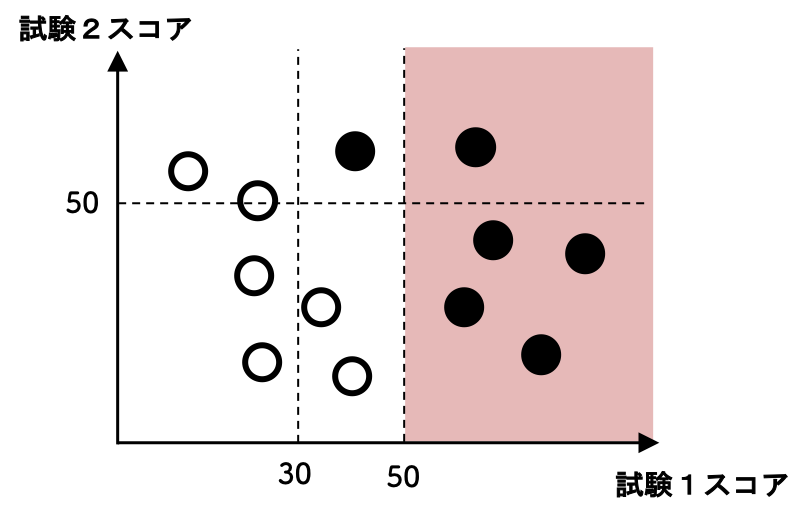
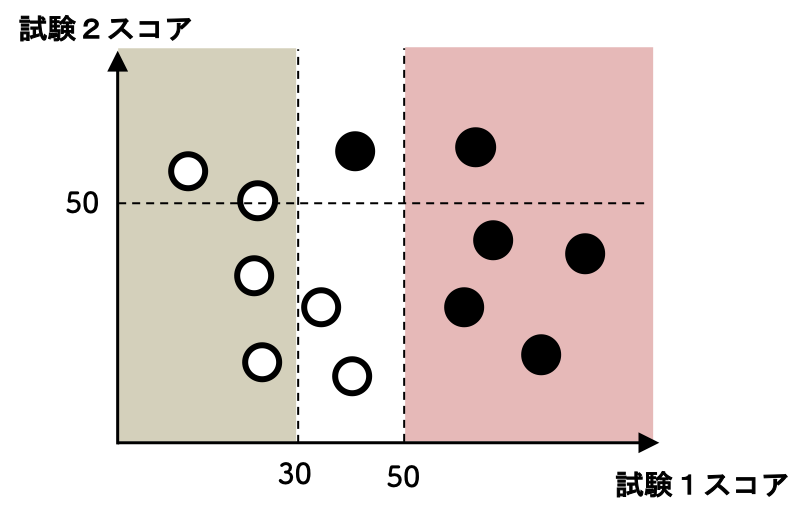
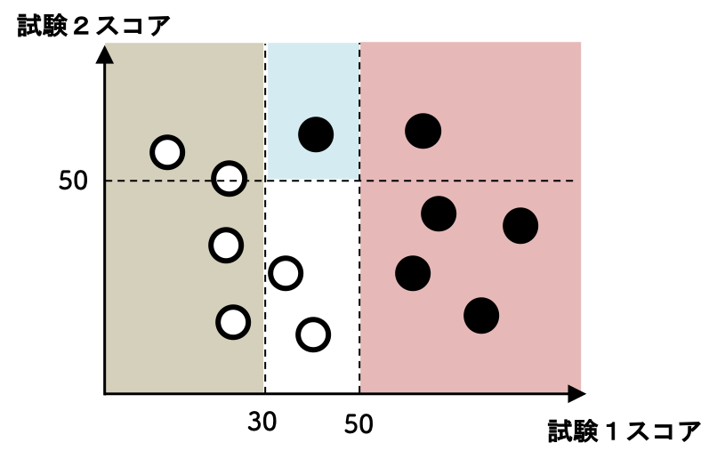
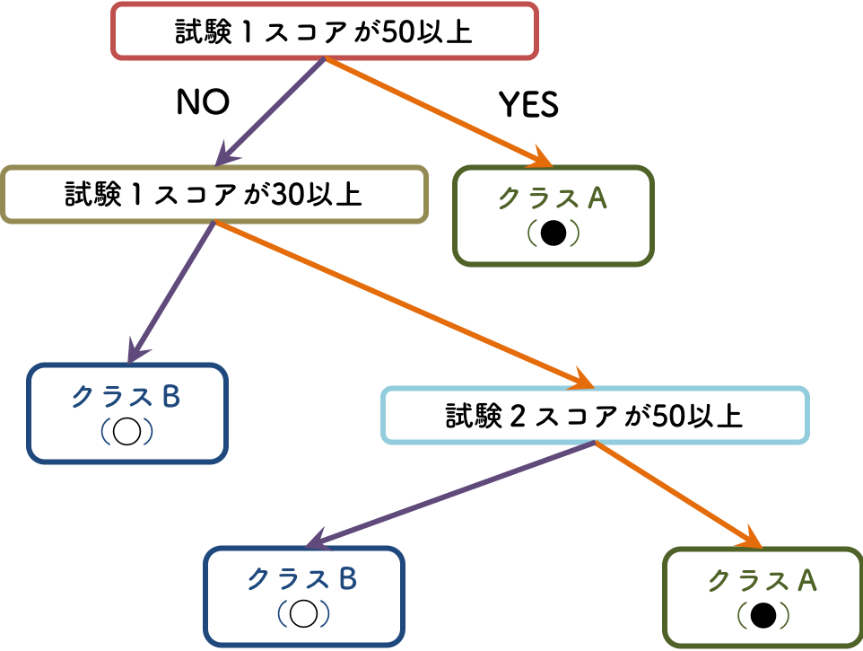

# 事前学習その２: SVM以外の方法

### サポートベクトルマシン以外の方法も試してみる

サポートベクトルマシンは「直線や平面で分類する」ので，分類のための「関数」を探すというのがその基本となります．直線や平面をパラメータを使って表しておいて，そのパラメータを調節する，という感じです．

データを解析する方法は通常一通りではありません．分類問題を解くための方法はほかにもあります．たとえば「関数」を探すのではなくて，「特徴を見て，何かしらのルールに基づいて分類する」という「ルール」を探すことを基本とする方法も知られています．ルールに基づいて，というと，人工知能っぽさを感じる人も多いかもしれません．

ここでは **決定木** と呼ばれるものを簡単に解説したあと，**ランダムフォレスト** に触れます．これまで同様，詳細については各自で調べてもらうことにします．とりあえずどのような手法なのか，SVMとはどのように違うのか，という点を最低限押さえておきましょう．実際に演習でコードを実行した際，SVMとはかなり異なった結果が出てきます．概要を知っておけば，どのようなときに使えそうか，などの判断にも使えるでしょう．

もちろん，きちんと使うためには，数式まで知っておくべきですのでご注意を．

***
### 決定木の概略

決定木はルールベースでデータを識別していきます．これまで関数の話ばかりでしたので，ルールベースについてわかりやすくするために，例を使って説明を進めます．

2つの試験を受けて，各生徒が上の図のように分かれたとします．クラスAの生徒が●，クラスBの生徒が◯だとしましょう．さて，ルールで分類したいので，色々な分け方があるとは思いますが，ひとまず試験1のスコアに着目しましょう．以下のように分けてみます．

試験1のスコアが50よりも大きいか小さいか，という分類です．大きい方は確実にクラスAの●に分類されます．次にクラスBの◯を確実に分類できるように下のように考えてみます．

これで試験1のスコアが30よりも大きいか小さいかというルールを使って，クラスBの◯を分類できます．最後に中間部分を見ましょう．

今度は試験2のスコアが50よりも大きいか小さいかで分類します．50よりも大きければクラスAの●，小さければクラスBの◯です．以上の手順でクラスの分類ができました．このルールを木の形で書くと次のようになります．

これがルールベースで決定する，という方法で，**決定木** と呼ばれます．これまでやってきたような数学の関数にもとづく方法とは違う，ということはわかったかと思います．何かの特徴量（上の例では，試験1のスコアか，試験2のスコアか）に着目しながら，分類をするためのルールを作っていく，という方法です．

もちろん，どの段階で，どの特徴量に着目するのかを選ぶ必要があります．そのあたりは数理的な手法を使って決めますし，方法も一通りではありません．詳しくは各自で，ということにしておきます．

さて，このようにルールベースで識別しますので，SVMのように関数で識別するのとは結果も大きく異なります．そのあたりは（次のランダムフォレストを）演習で試してみて，違いを目で見て確認してみましょう．そのあとで手法の部分に戻ってみると，違いも理解しやすくなるでしょうし，数理的な部分も調べてみる気になるかもしれません．

***
### ランダムフォレストの概略

決定木はひとつの「木」ですが，実は過学習を起こしやすい，ということが知られています．そのために「ランダム性を利用して」「たくさんの木を作って」組み合わせて使う方法が知られています．それがランダムフォレストです．木がたくさんあるから森（フォレスト）になるだけですね．

概略を以下の図に示します．

ここではデータをランダムに選びつつ，また使用する特徴量もランダムに選びます．簡単に言えば，訓練データを大きく変えて，その訓練データに対して決定木を作り，また別の訓練データを作ってまた決定木を・・という感じです．訓練データが変われば，当然，作られる決定木も変わります．こうやって作られたたくさんの決定木を使って多数決で最終的な結論を出します（**バギング** と呼ばれる手法のひとつです）．

基本は決定木ですので，ルールベースであり，関数に基づいたSVMなどとは結果は大きく異なります．実際に演習課題を進めるなかで実感してください．

***
### データの前処理について

説明したように，SVMとランダムフォレストでは考え方が根本的に異なります．SVMは関数で識別，ランダムフォレストはルールで識別，です．理論上はどちらもきちんと識別できるとしても，実際にパラメータを探したり，ルールを探したり，という段階になると難しいところが出てきたりします．

その難しさを顕著に見られるのが，SVMを使った場合のデータの前処理の重要性です．実際の演習で試してもらうのが一番ですが，少しだけ導入を説明しておきます．

上の図のデータは一見するとあまり違いがなさそうに見えますが，よくみると軸の尺度が全然違います．一方は大きな数値のスケールの軸と小さな数値のスケールの軸を持つデータ，もう一方は２つの軸が同じくらいのスケールです．

これらにSVMとランダムフォレスト（決定木）を用いると，どのような結果になるでしょうか？ ・・ということを，実際に演習で試してみます．

演習の結果と手法の考え方の違いの関係を考察してもらうことになりますが，ここで強調しておきたいことは「データの前処理」の重要性です．用いる手法によってはデータを前処理しておかないと適切な結果を得られない場合があります．「理論的には理論と実践は同じだが，実践的には理論と実践は違う」わけですね．もちろん，前処理をそれほどしなくても適切な解析ができる手法もあるわけです．手法についての理解が必要で，何も知らないままモジュール（ライブラリ）を使うのは危険ですし，解析結果に自信を持てなくなる原因ともなります．手法は大量に提案されていて，すべてを一度に学ぶのは無理ですので，その都度，自分できちんと調べて利用する習慣を身につけましょう．

さて，有名な前処理である **標準化** について，最後に簡単にだけ説明しておきます．

基本的には
1. 各軸（各特徴量）の平均値と分散（散らばり具合）を計算する
1. 各データの各軸（各特徴量）ごとに，平均値を引き算して，標準偏差，つまり分散のルート（平方根）で割り算する．

これらの作業により，各軸（各特徴量）に着目した時に，変換後のデータは「平均ゼロ」「分散１（標準偏差１）」に揃います．これで各軸ごとのスケールが揃うので，適切な解析をしやすくなる，というわけです．

データの前処理としては，たとえばデータ取得の際のミスなどでおかしな値が入ってしまったのを取り除く「外れ値処理」などがあります．もちろん，解析手法によってはこのような「外れ値」があっても適切な処理をできるものもあります．

用いる手法によってデータの前処理の必要性も変わってきます．解析に慣れてきたら，そのあたりにも注意を払って，データと手法に向き合うようにしましょう．

***
[>> 識別問題のトップページに戻る](./README.md)
***
&copy; 2019 &nbsp; Jun Ohkubo
